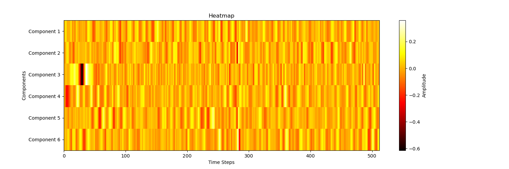
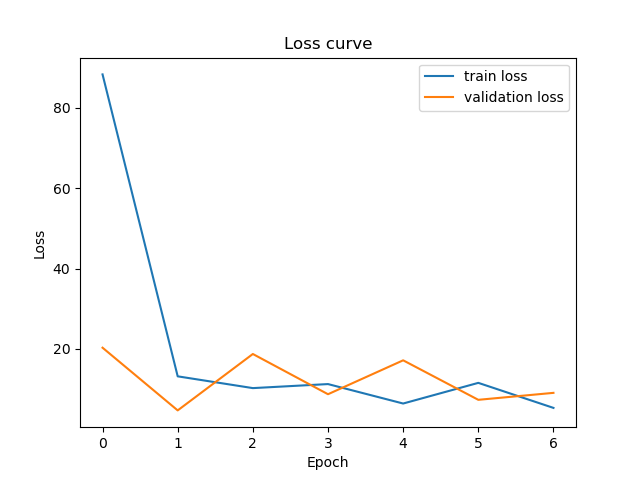

# EEG Spiking Neural Network Project

This project focuses on the **classification of brain signals** using **Electroencephalogram (EEG)** data and **Spiking Neural Networks (SNNs)**. The goal is to decode imagined speech from EEG signals and explore the potential of biologically inspired neural architectures for this challenging task.

<div align="center">
  
  <p style="text-align: center">Figure 1: EEG Signals Principal Compoenents Heatmap</p>
</div>


## Table of Contents

1. [Setup](#setup)
2. [Project Structure](#project-structure)
3. [Project Goals](#project-goals)
4. [Dataset](#dataset)
5. [Model Architecture](#model-architecture)
6. [Training Workflow](#training-workflow)
7. [Results](#results)
8. [Observations](#observations)
9. [Summary](#summary)
10. [Conclusions](#conclusions)


## Setup

To set up the project, follow the instructions provided in the [SETUP.md](docs/SETUP.md) file. This includes installing dependencies, configuring the environment, and preparing the dataset.

## Project Structure

```bash
│
├── artifacts                 # Excluded from the repository; stores data and models locally
│     ├── data
│     └── models
│
├── src                       # Source code for common utilities and CRISP-DM steps
│     ├── common        
│     └── modelling
│
├── dev-requirements.txt      # Testing dependencies
├── environment.yaml          # Conda environment dependencies
├── README.md                 # Project documentation
└── requirements.txt          # Core dependencies in pip format
```

## Project Goals

1. **Decode imagined speech from EEG signals.**
2. **Explore the use of Spiking Neural Networks (SNNs)** for EEG signal classification.
3. Investigate the challenges and limitations of SNNs in this domain.

## Dataset

The dataset used in this project is an **open-access EEG database** available [here](https://www.researchgate.net/publication/312953157_Open_access_database_of_EEG_signals_recorded_during_imagined_speech). It contains EEG signals recorded from 15 subjects imagining the pronunciation of:
- **Vowels:** /a/, /e/, /i/, /o/, /u/
- **Commands:** up, down, left, right, backward, forward

### Key Details:
- **Recording Setup:** Six-channel EEG acquisition system, sampled at 1024 Hz.
- **Preprocessing:** Signals were filtered between 2 Hz and 40 Hz using a finite impulse response (FIR) pass-band filter to remove artifacts.
- **Data Volume:** Each subject repeated each word 50 times in a random order.

This dataset provides a challenging benchmark for decoding imagined speech from EEG signals.

## Model Architecture

This project implements an **EEG Spiking Convolutional Neural Network (EEG-SCNN)** using the [SNNtorch](https://snntorch.readthedocs.io/) library. The architecture is designed to process EEG data and classify it into multiple categories using biologically inspired spiking neurons.

### Key Features:
- **Spiking Neural Network (SNN):** Implements leaky integrate-and-fire (LIF) neurons with surrogate gradient methods for backpropagation.
- **EEG Data Processing:** Includes preprocessing, normalization, and train-validation-test splitting.
- **Customizable Architecture:** Configurable hyperparameters such as learning rate, optimizer, loss function, and number of timesteps.
- **Training and Evaluation:** Supports early stopping, validation, and testing with metrics like accuracy and loss.
- **Visualization:** Generates training and validation loss/accuracy plots.
- **Device Support:** Fully compatible with GPU acceleration using PyTorch.

### Architecture Overview:
1. **Convolutional Layers:** Extract spatial features from EEG data.
2. **Pooling Layers:** Downsample feature maps to reduce dimensionality.
3. **Leaky Integrate-and-Fire (LIF) Neurons:** Simulate spiking behavior with learnable decay rates.
4. **Fully Connected Layers:** Map extracted features to output classes.
5. **Temporal Dynamics:** Processes input data over multiple timesteps to capture temporal patterns in EEG signals.

## Training Workflow

1. **Data Loading:** Preprocessed EEG data is loaded and split into training, validation, and test sets.
2. **Model Training:** The model is trained using a spiking cross-entropy loss function and the Adam optimizer.
3. **Validation:** Monitors validation accuracy and loss to select the best model parameters.
4. **Early Stopping:** Stops training if no improvement is observed for a specified number of epochs.
5. **Testing:** Evaluates the model on the test set using the best parameters.

## Results

- The model did not achieve the desired accuracy due to the inherent difficulty of the problem.
- Training and validation curves were generated and saved for further analysis.

<div align="center">
  
    <p style="text-align: center">Figure 2: Training and Validation Loss Curves</p>
</div>


## Observations

- **Inverse Behavior:** The brain processes stimuli to generate spikes, which result in EEG signals, while the SNN processes EEG signals to generate spikes.
  - **Brain:** Stimuli → Spikes → EEG
  - **SNN:** EEG → Spikes → Stimuli
- **Alternative Approach:** Consider predicting EEG signals from stimuli instead, with a different loss function.
- **Multi-Level Problem:** The problem spans multiple levels:
  - Experiment → Subject → Trial → Stimuli
- **Future Directions:** Explore models that process data across all levels.

## Summary

1. **Data Exploration:** Preprocessing of raw EEG data, including normalization, CAR-referencing, ICA-filtering, and spike encoding.
2. **Data Packaging:** Splitting data into training, validation, and test sets.
3. **Model Training:** Training SNN models with hyperparameter optimization and evaluation using confusion matrices.


## Conclusions

1. **Global Optimization Challenges:** SNNs face challenges with global optimization methods.
2. **Delta Coding Limitations:** Delta coding may not be sufficient for this task.
3. **Preferred Methods:** Filter/convolution-based preprocessing methods are likely more effective.
